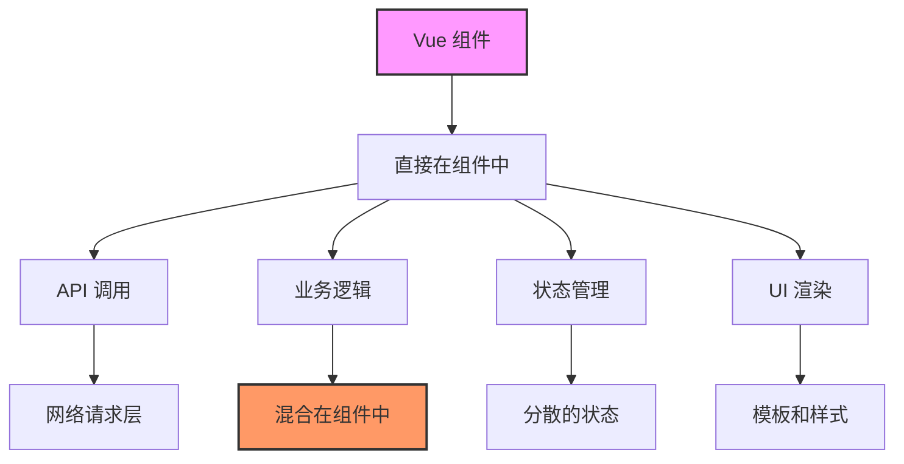
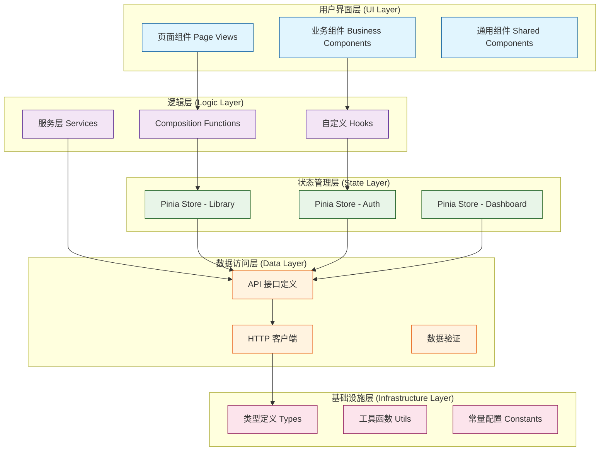
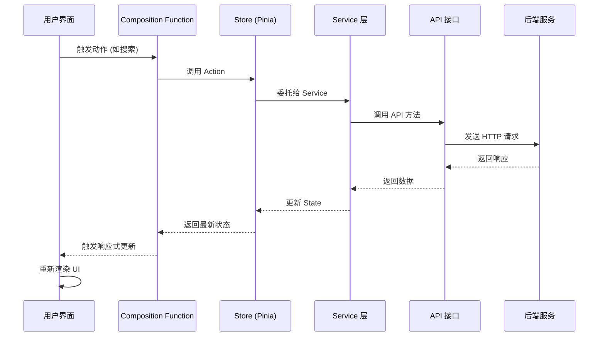
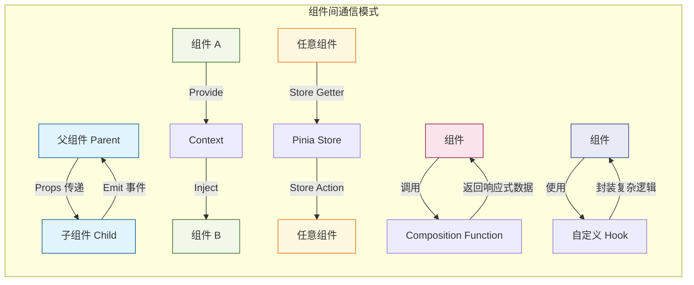
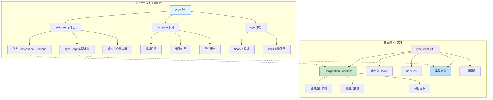
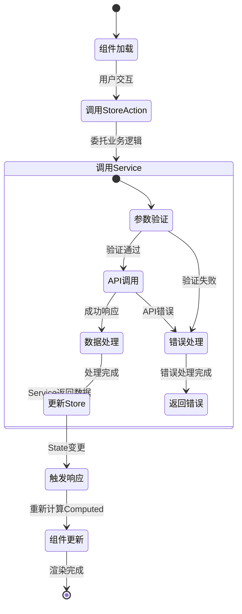
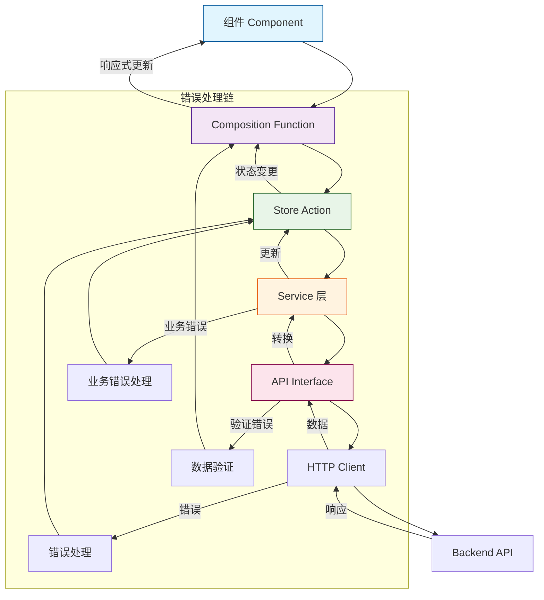
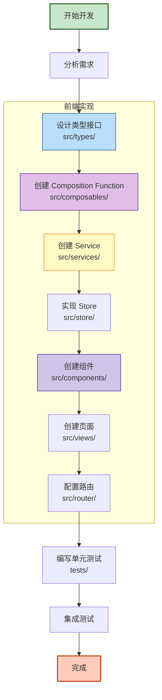
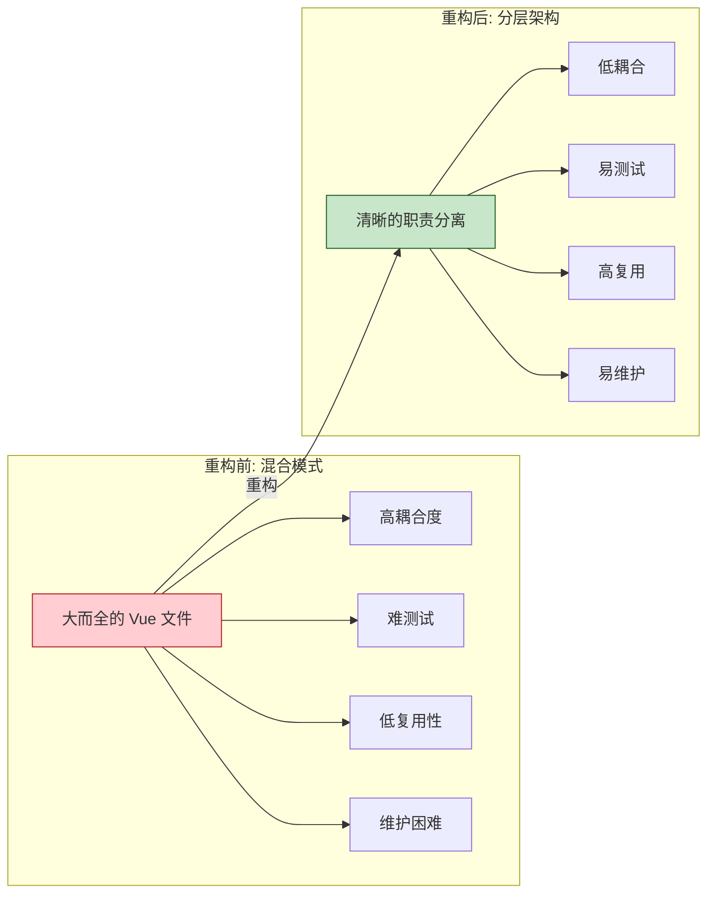

# Scider 前端项目架构流程图

## 1. 当前架构（重构前）



## 2. 目标架构（重构后）



## 3. 模块化组织结构

```mermaid
graph TD
    subgraph "根目录结构"
        src[src/]
    end
    
    src --> modules
    src --> shared
    src --> views
    src --> router[router/]
    src --> store[store/]
    
    subgraph "shared/ (共享层)"
        shared --> shared_components[components/]
        shared --> shared_composables[composables/]
        shared --> shared_utils[utils/]
        shared --> shared_types[types/]
    end
    
    subgraph "modules/ (功能模块)"
        modules --> library
        modules --> auth
        modules --> dashboard
        modules --> graph
        modules --> discover
    end
    
    subgraph "library/ (论文库模块)"
        library --> lib_components[components/]
        library --> lib_composables[composables/]
        library --> lib_services[services/]
        library --> lib_types[types/]
        library --> lib_views[views/]
        library --> lib_index[index.ts]
    end
    
    subgraph "auth/ (认证模块)"
        auth --> auth_components[components/]
        auth --> auth_composables[composables/]
        auth --> auth_services[services/]
        auth --> auth_index[index.ts]
    end
    
    shared_composables --> shared_hooks[通用 Hooks]
    shared_components --> ui_components[UI 组件]
    
    lib_composables --> useLibraryManagement
    lib_services --> LibraryService
    lib_components --> FolderTree
    lib_components --> PaperList
    
    style src fill:#bbdefb,stroke:#0d47a1,stroke-width:3px
    style modules fill:#c8e6c9,stroke:#1b5e20
    style shared fill:#fff9c4,stroke:#f57f17
    style library fill:#e1bee7,stroke:#4a148c
    style auth fill:#ffccbc,stroke:#bf360c
```

## 4. 数据流架构



## 5. 组件通信模式



## 6. 文件职责分离示意图



## 7. 状态管理流程图



## 8. API 调用链



## 9. 开发工作流程



## 10. 总结：架构优势对比



---

## 架构核心原则

1. **单一职责原则**: 每个文件/类/函数只负责一件事
2. **依赖倒置原则**: 高层模块不依赖低层模块，都依赖抽象
3. **开闭原则**: 对扩展开放，对修改关闭
4. **关注点分离**: UI、逻辑、数据、状态各司其职
5. **最小知识原则**: 组件只了解必要的依赖

## 技术决策依据

1. **使用 Composition API**: 更好的逻辑复用和代码组织
2. **模块化架构**: 按功能划分，提高内聚降低耦合
3. **TypeScript 优先**: 类型安全，更好的开发体验
4. **Pinia 状态管理**: Vue 3 官方推荐，TypeScript 友好
5. **Service 层抽象**: 分离业务逻辑和 UI 逻辑

这个架构设计支持项目的长期演进，能够随着功能增加而扩展，同时保持代码的可维护性和可测试性。